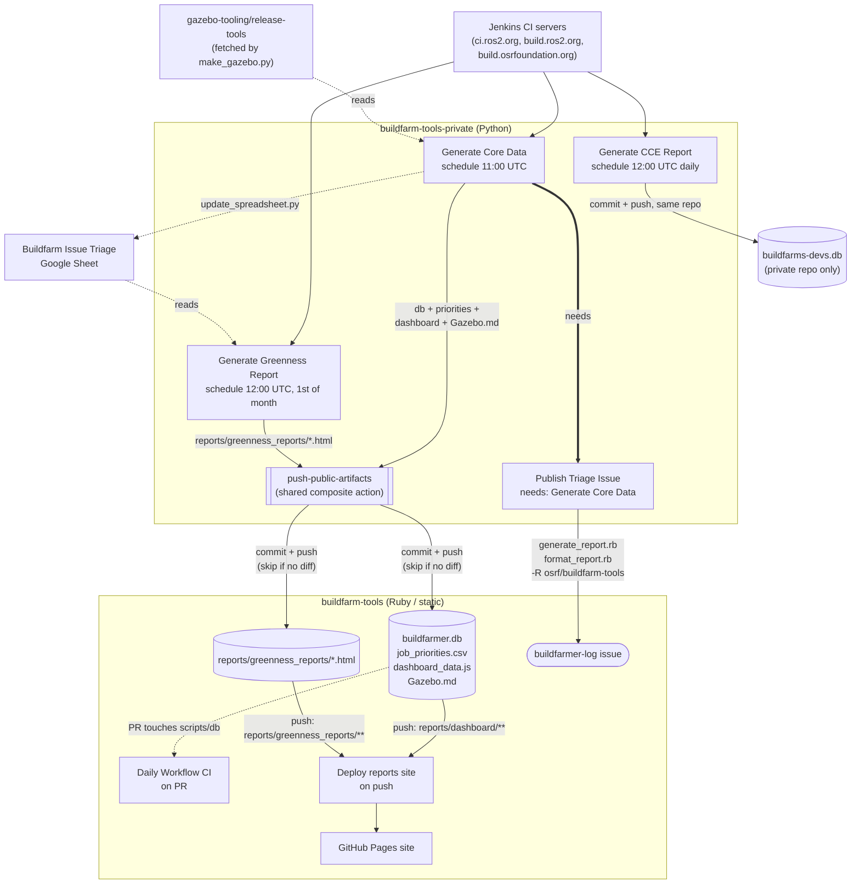

# Buildfarm tools automation workflows

To support the daily work of the buildfarmers, this project runs six GitHub Actions
workflows split across the two repos. The private repo owns all data generation,
scheduling, and orchestration; the public repo owns hosting only — GitHub Pages, the
buildfarmer-log issue, and PR-time validation of its own Ruby scripts.

| Workflow | Repo | Trigger | Pushes to `buildfarm-tools`? |
|---|---|---|---|
| [Generate Core Data](#generate-core-data) | private | schedule `0 11 * * *`, PR, dispatch | yes — `buildfarmer.db`, `job_priorities.csv`, `dashboard_data.js`, `Gazebo.md` |
| [Publish Triage Issue](#publish-triage-issue) | private | `needs:` after Generate Core Data, dispatch | no — comments on a GitHub issue in `buildfarm-tools` instead |
| [Generate CCE Report](#generate-cce-report) | private | schedule `0 12 * * *`, dispatch | no — commits only to the private repo |
| [Generate Greenness Report](#generate-greenness-report) | private | schedule `0 12 1 * *`, PR, dispatch | yes — `reports/greenness_reports/<year>/*.html` |
| [Buildfarmer Log Daily Report Generation CI](#buildfarmer-log-daily-report-generation-ci) | public | PR on scripts/db changes, dispatch | no — validation only, uploads artifacts |
| [Deploy reports site to GitHub Pages](#deploy-reports-site-to-github-pages) | public | `push` to `main` touching reports paths, dispatch | no — deploys to GitHub Pages |

All times are UTC. The private workflows use `secrets.GH_TOKEN` (a token with write
access to `buildfarm-tools`, including `issues: write` now that issue publishing lives
there too) — that's why they're described as "private": only the buildfarmers who hold
that secret can run or approve them.

Every workflow that pushes to `buildfarm-tools` does so through one shared composite
action, `buildfarm-tools-private/.github/actions/push-public-artifacts`, instead of
each workflow carrying its own copy-pasted git plumbing. It stages the given paths,
skips the commit entirely if nothing changed, and retries the push with a fetch+rebase
if it's rejected as non-fast-forward — see [the action
itself](https://github.com/osrf/buildfarm-tools-private/blob/main/.github/actions/push-public-artifacts/action.yml)
for the exact retry/backoff behavior.

---

## Generate Core Data

**File:** `buildfarm-tools-private/.github/workflows/generate-core-data.yml`
**Runs:** daily at 11:00 UTC (also on `workflow_dispatch` and on PRs that touch the
fetcher script, `common.py`, `scripts/generate_dashboard.py`, or `make_gazebo.py`)

This is the root of the pipeline — every other workflow either consumes data this one
produces or is chained directly off it.

Job `update-database-and-issues`, steps in order:
1. Checks out `buildfarm-tools-private`, clones `buildfarm-tools` alongside it.
2. Runs `databaseFetcher.py`, which walks every job in `common.py`'s registry, pulls new
   builds from Jenkins, classifies failures, and writes results into
   `buildfarm-tools/database/buildfarmer.db`.
3. Runs `generate_priorities.py` and moves the resulting `job_priorities.csv` into
   `buildfarm-tools/database/scripts/lib/`.
4. Runs `scripts/update_issues_state.py` to refresh known-issue GitHub state.
5. Runs the Ruby `BuildfarmToolsLib::update_issues_priority` to re-rank issues (invoked
   by cloning `buildfarm-tools` and `cd`-ing into `database/scripts` — the Ruby scripts
   themselves stay in the public repo; this is just remote invocation).
6. Runs `scripts/generate_dashboard.py` to build
   `buildfarm-tools/reports/dashboard/dashboard_data.js`.
7. Runs `make_gazebo.py > buildfarm-tools/Gazebo.md` (`continue-on-error: true`, so a
   failed upstream fetch never blocks the rest of the job).
8. On schedule (or if `update-spreadsheet-input` is set), runs `update_spreadsheet.py`
   to refresh the Buildfarm Issue Triage Google Sheet.
9. On schedule (or if `push-changes` is set), calls `push-public-artifacts` with
   `buildfarmer.db`, `job_priorities.csv`, `dashboard_data.js`, and `Gazebo.md`. Only
   the files that actually changed end up in the commit — there's no separate
   "did the Gazebo job list change" check anymore; the push action's content diff
   handles that implicitly (see below).

A second job, `publish-triage-issue`, runs `needs: update-database-and-issues` and
calls **Publish Triage Issue** as a reusable workflow (guarded with
`if: github.event_name != 'pull_request'` so PR runs never touch the live issue).

That push to `buildfarm-tools` also satisfies the path filter for **Deploy reports site
to GitHub Pages** (via `reports/dashboard/**`).

> **Folding in the Gazebo dashboard:** this used to be a separate workflow
> (`updateGzDashboard.yml`) triggered by `workflow_run` after the fetcher, gated by
> comparing commit timestamps of gazebo-tooling's `generated_jobs.txt` against
> `Gazebo.md`. That timestamp comparison was a proxy for "did the content change" and
> could be wrong in both directions. `make_gazebo.py` is a single cheap unauthenticated
> fetch, so it's now just another step in this job, and the push action's
> `git diff --cached --quiet` check is the real "did anything change" gate.

More information: [Buildfarm Triage
Tools](https://github.com/osrf/buildfarm-tools-private/blob/main/docs/buildfarm_triage_tools.md#database-fetching-scripts)
and [Job Priorities](./job_priorities.md).

> **Note**: private workflow — requires `secrets.GH_TOKEN`.

## Publish Triage Issue

**File:** `buildfarm-tools-private/.github/workflows/publish-triage-issue.yml`
**Runs:** chained via `needs:` from **Generate Core Data**'s `publish-triage-issue`
job (declared as `on: workflow_call`), plus standalone `workflow_dispatch` for manual
testing

This used to be `buildfarm-tools/.github/workflows/dailyWorkflow.yml`, running on its
own 11:30 UTC schedule with no formal link to the fetcher — just a 30-minute gap and a
hope that the fetcher had already finished. It's now a real dependency: this job only
starts once `update-database-and-issues` has succeeded.

1. On Mondays (or with the `clear-log` input), closes the current [buildfarmer-log
   issue](https://github.com/osrf/buildfarm-tools/labels/buildfarmer-log) and opens a
   new one for the week, linking back to the previous one — via `gh issue close/create
   -R osrf/buildfarm-tools`, cross-repo, using `secrets.GH_TOKEN` (the default
   same-repo `GITHUB_TOKEN` won't work here since the target issue lives in a
   different repo than the one running the workflow).
2. Clones `buildfarm-tools` and runs `database/scripts/generate_report.rb` against
   `buildfarmer.db` to produce a JSON triage report, uploading it as a build artifact
   and surfacing any "no priority for job" warnings as workflow annotations.
3. Runs `format_report.rb` to turn that JSON into Markdown.
4. Posts the Markdown as a comment on the current weekly log issue via
   `gh issue comment -R osrf/buildfarm-tools`.

The `generate_report.rb`/`format_report.rb`/`lib/buildfarm_tools.rb` scripts themselves
were deliberately **not** moved into the private repo — they stay in `buildfarm-tools`
so buildfarmers can keep running them locally exactly as documented (`ruby
buildfarm-tools/database/scripts/generate_report.rb`), and so there's still exactly one
copy of the Ruby report pipeline, not two.

> **Note**: private workflow — requires `secrets.GH_TOKEN` with `issues: write` on
> `osrf/buildfarm-tools`.

## Generate CCE Report

**File:** `buildfarm-tools-private/.github/workflows/generate-cce-report.yml`
**Runs:** daily at 12:00 UTC, plus `workflow_dispatch`

Despite the name, it runs *daily* — "CCE" is Jenkins' `ClosedChannelException`; "weekly"
in the old name referred to the summary report, not the scan. It's entirely
self-contained: it never touches `buildfarmer.db` or `common.py`, and it never pushes
to `buildfarm-tools`.

1. Runs `buildfarms-devs/scan_closed_channel.py`, which incrementally scans Jenkins
   console logs for `ClosedChannelException` and writes new rows into
   `buildfarms-devs/database/buildfarms-devs.db` (a `last_scanned` table keeps the scan
   incremental — only new build numbers are fetched).
2. If today is Monday (or the run was manually dispatched), dumps the `cce_summary` SQL
   view to a dated `.txt` report under `buildfarms-devs/database/reports/`.
3. Commits the database and any new report file back to `buildfarm-tools-private`
   itself (not the public repo, and not through `push-public-artifacts` — it never
   leaves the private repo, so the shared action doesn't apply here).

## Generate Greenness Report

**File:** `buildfarm-tools-private/.github/workflows/generate-greenness-report.yml`
**Runs:** the 1st of each month at 12:00 UTC, plus PR (on changes to the workflow file
or `greenness_report.py`) and `workflow_dispatch`

Generates the prior month's pass/fail HTML report via `greenness_report.py` (uses
`datapane`/`pandas`/`matplotlib`/`plotly`, and reads the Google spreadsheet
credentials). The output HTML is moved into
`buildfarm-tools/reports/greenness_reports/<year>/`. On schedule (or with
`push-changes`), it's pushed via `push-public-artifacts` — which in turn satisfies the
path filter for **Deploy reports site to GitHub Pages**.

## Buildfarmer Log Daily Report Generation CI

**File:** `buildfarm-tools/.github/workflows/daily-workflow-ci.yml`
**Runs:** on pull requests touching `database/scripts/lib/*`,
`generate_report.rb`, `format_report.rb`, `buildfarmer.db`, or the daily-workflow
YAML file; plus `workflow_dispatch`

Unchanged by this refactor. A dry-run / regression check for the report pipeline used
by **Publish Triage Issue**. It generates the same JSON and Markdown reports but never
posts to an issue and never pushes — it only uploads them as PR artifacts (named after
the branch, 5-day retention) so a reviewer can eyeball the rendered output before
merging changes to the report generators. It stays in the public repo specifically
because the Ruby scripts it validates still live and get edited there.

## Deploy reports site to GitHub Pages

**File:** `buildfarm-tools/.github/workflows/deploy-reports-site.yml`
**Runs:** on push to `main` touching `reports/greenness_reports/**` or
`reports/dashboard/**`, plus `workflow_dispatch`

The terminal step of the pipeline. Assembles `reports/greenness_reports/` (year/report
HTML files) and `reports/dashboard/` (the JS bundle from Generate Core Data) into a
`.pages/` directory, generates a `tree`-based HTML index, and deploys it to GitHub
Pages. It's triggered automatically whenever **Generate Core Data** or **Generate
Greenness Report** pushes matching files to `main`.

---

## Interaction diagram

Key relationships not obvious from the individual YAML files:

- **Generate Core Data is upstream of almost everything.** It's the only workflow that
  talks to Jenkins *and* writes `buildfarmer.db`; everything else either is chained off
  it (`needs:` for Publish Triage Issue) or off its push (path-filtered `push` for the
  Pages deploy).
- **Publish Triage Issue is now a real dependency, not a schedule guess.** The old
  `dailyWorkflow.yml` ran on its own 11:30 UTC schedule with nothing but a 30-minute gap
  guaranteeing the fetcher had already run. It's now `needs: update-database-and-issues`
  inside the same workflow file — a failure in core data generation now correctly blocks
  the triage post instead of silently letting it report on stale data.
- **One shared push action, one diff-based gate.** `push-public-artifacts` replaces
  three separate copies of `git write-tree`/`commit-tree`/`update-ref` plumbing, and its
  `git diff --cached --quiet` check is also what replaced the old Gazebo-dashboard
  timestamp comparison — "did anything actually change" is now answered the same way
  everywhere.
- **Generate CCE Report is still an island.** It shares the private repo but not
  `common.py` or `buildfarmer.db` — its own `buildfarms-devs.db` lives and is committed
  inside `buildfarm-tools-private`, never crossing into the public repo, and it doesn't
  use the shared push action since it never pushes cross-repo.
- **The GitHub Pages deploy is still push-triggered, not workflow-triggered** — it fires
  off path filters (`reports/greenness_reports/**`, `reports/dashboard/**`), so it
  responds to pushes from *both* Generate Core Data (dashboard bundle) and Generate
  Greenness Report (HTML reports), independently.
- **The Ruby report pipeline still lives entirely in the public repo.** Publish Triage
  Issue invokes it by cloning `buildfarm-tools` and `cd`-ing into `database/scripts`,
  the same pattern Generate Core Data already used for the priority-update step — no
  code duplication, and buildfarmers' documented manual commands keep working
  unchanged.
